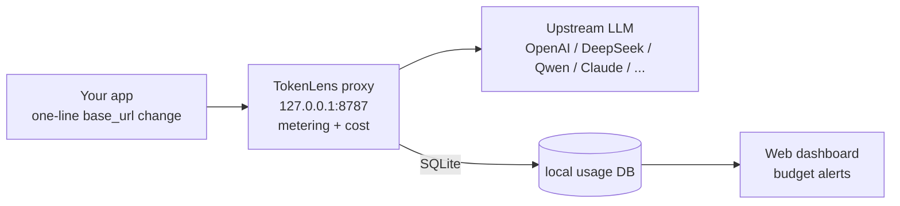

# TokenLens · AI Token Usage Monitor

A zero-intrusion local transparent proxy: change one line of `base_url`, and every AI call's token count, cost and latency lands in local SQLite, with a "cost ledger" dashboard and budget alerts. Data never leaves your machine. No cloud services required.

**[中文版 README](README.md)**

## Quick Start

```bash
pip install .                # installs the tokenlens command (or: pip install -r requirements.txt)
python -m tokenlens start    # proxy + dashboard, default 127.0.0.1:8787
```

Then point your client's base_url at it:

```bash
export OPENAI_BASE_URL=http://127.0.0.1:8787/v1
export OPENAI_API_KEY=sk-xxx    # key is forwarded to upstream as-is, never stored
```

Open **http://127.0.0.1:8787** for the dashboard. No real key? Still try it: run `python examples/mock_upstream.py` for a mock upstream, or `python -m tokenlens seed-demo` to load demo data.

## Demo

30-second real walkthrough (recorded in the browser: skeleton loading, KPI count-up animation, chart dimension switching, row expand, settings drawer, alert timeline):

<video src="docs/media/tokenlens-promo.mp4" controls width="720" poster="docs/media/desktop.png"></video>

Video file: `docs/media/tokenlens-promo.mp4` (22s, ~1.5 MB)

Desktop dashboard:


Settings drawer (daily/monthly budget, hard enforcement, FX rate, webhook, price overrides):


Budget alert timeline:


Mobile layout:


## Brand Assets

Brand promo video (30s: branded intro -> live demo -> branded outro):

<video src="docs/media/tokenlens-brand.mp4" controls width="720" poster="docs/media/brand-wide.png"></video>

Brand key visual - wide (1600x900, for website / social cover / articles):


Brand key visual - vertical (1080x1440, for Xiaohongshu / Moments / mobile poster):


## How It Works



No business-code changes, your API key never touches the proxy's storage (Authorization header is forwarded as-is), and all data stays on your machine.

## Dashboard (Cost Ledger)

- **Money first**: big daily / monthly spend numbers with daily / monthly budget bars — amber past 80%, red when over; edit budgets right on the panel
- **Usage trend**: switch cost / tokens / requests / latency, aggregated hourly or daily
- **Cost breakdown**: see who's spending, by model / project / provider
- **Call details**: sortable column headers, status / provider filters, pagination, click a row to expand error details, CSV export
- **Settings drawer**: budgets, FX rate, alert webhook, price overrides, clear data — all on one screen
- First-run shows an onboarding banner at the top (one-click copy of base_url); **open `tokenlens/web/index.html` offline to browse the embedded demo data**

## Multi-Provider Routing

Route by path alias on the same port (aliases configured in `~/.tokenlens/config.json` under `upstreams`; openai / deepseek / moonshot / zhipu / dashscope / anthropic / siliconflow are built in):

```
http://127.0.0.1:8787/v1/chat/completions           → default upstream
http://127.0.0.1:8787/v1/deepseek/chat/completions  → DeepSeek
http://127.0.0.1:8787/v1/dashscope/chat/completions → Qwen (OpenAI-compatible)
http://127.0.0.1:8787/v1/anthropic/v1/messages      → Claude native API
```

Header `X-TokenLens-Upstream: <url>` temporarily overrides the upstream; `X-TokenLens-Project: <name>` tags requests with a business label (used for per-project stats).

## Metering & Cost

- **SSE streaming**: chunks are forwarded as they arrive while usage is parsed line-by-line; `stream_options.include_usage` is injected automatically; time-to-first-token (TTFT) is recorded
- **Accuracy first**: uses exact usage when the upstream returns it (including cache hits and reasoning tokens); falls back to tiktoken, then to a CN/EN weighted estimate (marked `估`/est. in details)
- **Cost model**: price table synced from LiteLLM (2000+ models, refresh with `scripts/sync_pricing.py`); Doubao / Kimi and other domestic models have built-in fallbacks; cache hits are discounted per provider (OpenAI 0.25x); unknown models cost 0 so they don't pollute reports
- Override a price: `python -m tokenlens pricing --set-model my-model 1.0 4.0` (USD / 1M tokens)

## Budget Alerts

```bash
python -m tokenlens budget --daily 20 --monthly 400
```

Alerts fire at 80% of the threshold (daily budgets alert at most once per hour, monthly at most once per 24h, to avoid spamming): the dashboard budget bar changes color, console output, optional webhook push (DingTalk / WeCom / Feishu / generic JSON). History is visible in the dashboard's "Budget alerts" section and via `python -m tokenlens alerts`.

**Hard enforcement** (on by default): once the budget is exceeded, new requests are rejected with 402 instead of being forwarded upstream (response carries `X-TokenLens-Scope: daily|monthly`, rows are marked "rejected"); disable it in the settings drawer or with `config set enforce_budget false`, and `enforce_budget_ratio` lets you start rejecting earlier, e.g. 0.8 = block at 80%.

## CLI

```bash
python -m tokenlens start       [--port 8787] [--upstream URL] [--daily 20]
python -m tokenlens stats       [--range 7d] [--project X] [--model Y] [--json]
python -m tokenlens top         [--field model|project|provider|endpoint|day]
python -m tokenlens export      [--out usage.csv] [--range 30d]
python -m tokenlens pricing     [--model gpt-4o] [--set-model NAME IN OUT]
python -m tokenlens budget      [--daily 20] [--monthly 400]
python -m tokenlens alerts      [--limit 20]
python -m tokenlens seed-demo   [--n 600] [--days 7]
python -m tokenlens reset       # wipe all data
python -m tokenlens live        # watch the last 60s of traffic in real time
python -m tokenlens config get KEY          # read a single config key
python -m tokenlens config set KEY VALUE    # set a config key (auto type conversion)
python -m tokenlens doctor      # environment self-check
```

## Configuration (`~/.tokenlens/config.json`)

| Key | Default | Description |
|---|---|---|
| `port` / `host` | 8787 / 127.0.0.1 | Listen address |
| `upstreams` | 7 built-in | Path alias → upstream base url |
| `default_upstream` | OpenAI | Forward target when no alias matches |
| `budget_daily` / `budget_monthly` | 10 / 200 | Budgets (USD); 0 = unlimited |
| `cached_discounts` | `{"openai": 0.25}` | Cache-hit discount per provider |
| `pricing_overrides` | `{}` | Custom prices `{model:{in,out}}` USD/1M |
| `usd_cny_rate` | 7.2 | CNY conversion on the dashboard |
| `webhook_url` / `webhook_type` | empty / generic | Alert webhook URL and channel (dingtalk / wecom / feishu) |
| `inject_stream_usage` | true | Ask upstream to return usage on streaming |
| `dashboard_token` | empty | Dashboard access token (empty = no auth; once set, APIs need `Authorization: Bearer <token>`) |
| `enforce_budget` | true | Hard budget enforcement (402 rejection when over) |
| `enforce_budget_ratio` | 1.0 | Rejection threshold (ratio of budget; 0.8 = block at 80%) |

Quick env vars: `TOKENLENS_PORT`, `TOKENLENS_UPSTREAM`, `TOKENLENS_DAILY_BUDGET`.

## Tests

```bash
python scripts/smoke_test.py   # end-to-end smoke (38: proxy/streaming/concurrency/budget/enforcement/trace headers/SDK/CLI)
python scripts/unit_test.py    # unit tests (34: pricing/cost/store/enforcement/auth/webhook)
```

## Layout

```
tokenlens/
├── tokenlens/                # package
│   ├── proxy.py              # transparent proxy (SSE line-buffer parsing + shared connection pool)
│   ├── meter.py              # metering core + budget alerts + webhook cards
│   ├── tokenizer.py          # token counting (usage > tiktoken > heuristic)
│   ├── pricing.py            # price table (LiteLLM sync + built-in fallbacks) and cost math
│   ├── store.py              # SQLite storage & aggregation (read conn + dedicated write conn)
│   ├── api.py                # dashboard REST API (stats / settings / export / alerts)
│   ├── server.py             # app assembly (shared httpx connection pool)
│   ├── sdk.py                # decorator / monkeypatch instrumentation
│   ├── demo.py               # demo data generation
│   ├── pricing_data.json     # LiteLLM price snapshot (refresh via sync_pricing.py)
│   └── web/                  # single-file dashboard (offline demo) + self-hosted ECharts
├── examples/mock_upstream.py # mock upstream
├── scripts/smoke_test.py     # end-to-end tests
├── scripts/unit_test.py      # unit tests
└── scripts/sync_pricing.py   # sync model price table
```

## Privacy & Boundaries

- Only metadata is recorded (model, tokens, cost, latency, status, byte counts) — never prompt / response content
- Authorization headers are forwarded but never stored; only a SHA-256 first-12-char fingerprint of your API key is kept
- Single-machine, single-process SQLite — built for personal and small-team local gateways; for cross-machine rollups, `export` CSV periodically

Repository: <https://gitcode.com/badhope/tokenlens>
