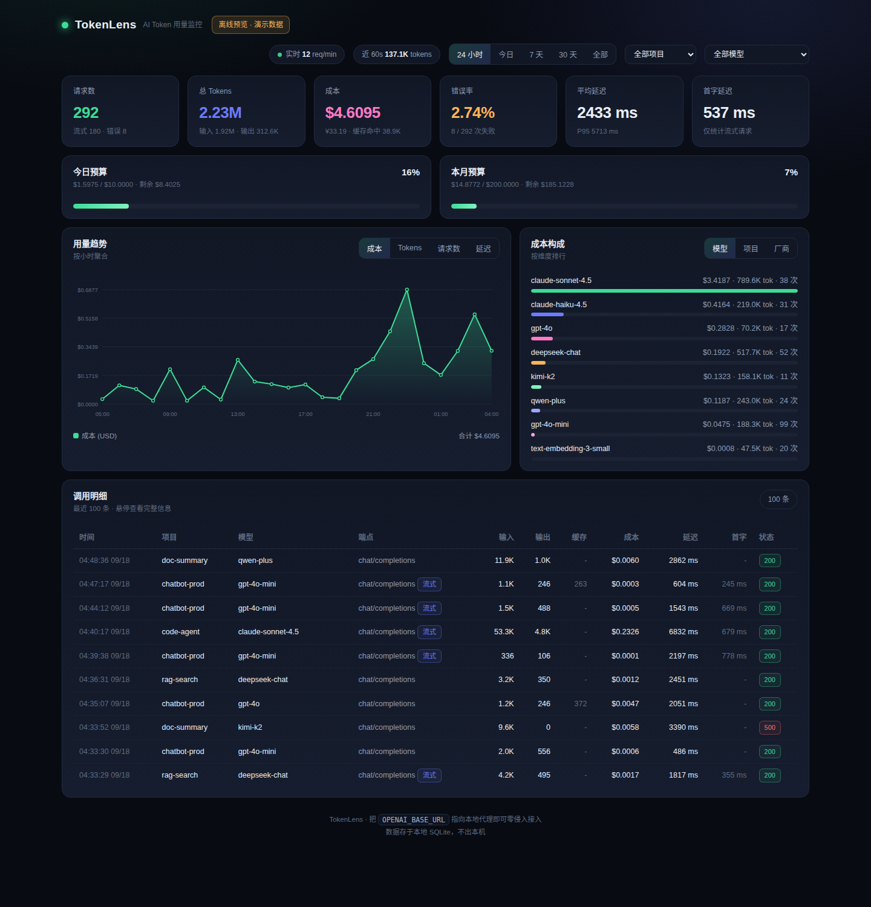
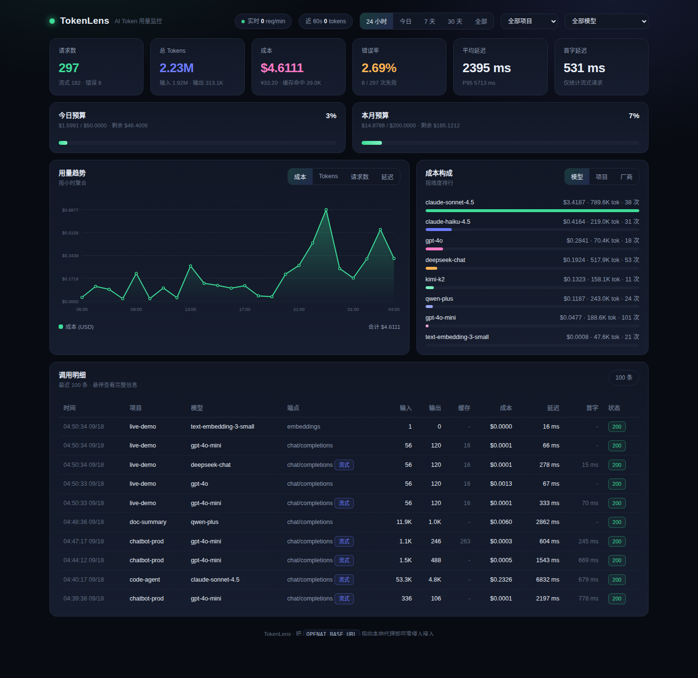

# TokenLens · AI Token 用量监控

一个**零侵入**的本地 AI Token 计量与监控工具：一条命令启动，把 `base_url` 改成本地代理，所有大模型调用的 token 消耗、成本、延迟、错误便尽收眼底。自带 Web 仪表盘、预算告警、CLI 报表和 Python SDK。

开源地址：https://gitcode.com/badhope/tokenlens



## 为什么是代理模式

| 方案 | 侵入性 | 覆盖面 | 说明 |
|---|---|---|---|
| **本地透明代理（主力）** | 改一行 `base_url` | 任何语言/框架/命令行工具 | 请求经过代理时顺带计量，上游无感知 |
| Python SDK 埋点 | 加两行代码 | 仅 Python | 不想跑代理时用装饰器 / monkeypatch |

不改任何业务代码，不碰你的 API Key（Authorization 头原样转发，代理不存储），数据全部留在本机 SQLite。

## 快速开始

```bash
pip install -r requirements.txt          # 或者 pip install .（会装上 tokenlens 命令）
pip install tiktoken                     # 可选：上游不返回 usage 时用于精确计数

# 启动（默认 127.0.0.1:8787，代理与仪表盘同一个服务）
python -m tokenlens start

# 指定默认上游与日预算
python -m tokenlens start --upstream https://api.deepseek.com/v1 --daily 20
```

然后把客户端的 base_url 指过来即可：

```bash
# OpenAI SDK
export OPENAI_BASE_URL=http://127.0.0.1:8787/v1
export OPENAI_API_KEY=sk-xxx        # key 原样透传给上游

# curl 直接验证
curl http://127.0.0.1:8787/v1/chat/completions \
  -H "Authorization: Bearer $OPENAI_API_KEY" \
  -d '{"model":"gpt-4o-mini","messages":[{"role":"user","content":"hi"}]}'
```

打开 **http://127.0.0.1:8787** 查看仪表盘。

> 没有真实 Key 也能玩：`python examples/mock_upstream.py` 起一个模拟上游，再 `python -m tokenlens start --upstream http://127.0.0.1:8901/v1`；或直接 `python -m tokenlens seed-demo` 灌入演示数据。

## 多厂商接入

同一端口按**路径别名**路由到不同上游（别名在 `~/.tokenlens/config.json` 的 `upstreams` 里配置，内置 openai / deepseek / moonshot / zhipu / dashscope / anthropic / siliconflow）：

```
http://127.0.0.1:8787/v1/chat/completions          → 默认上游
http://127.0.0.1:8787/v1/deepseek/chat/completions → DeepSeek
http://127.0.0.1:8787/v1/dashscope/chat/completions → 通义千问（OpenAI 兼容模式）
http://127.0.0.1:8787/v1/anthropic/v1/messages     → Claude 原生 API
```

也可以用请求头临时指定：`X-TokenLens-Upstream: https://your-gateway/v1`。

给调用打业务标签（用于按项目统计）：

```bash
curl ... -H "X-TokenLens-Project: chatbot-prod"
```

## 流式与计量

- **SSE 流式**：逐 chunk 透传，同时解析上游 usage；自动注入 `stream_options.include_usage`（OpenAI 兼容上游），并记录**首字延迟（TTFT）**；
- **精确优先**：能用上游返回的 `usage` 就用精确值（含缓存命中、推理 token）；
- **估算兜底**：上游不回传 usage 时，用 tiktoken 精确编码；tiktoken 不可用再退化为中英加权启发式，明细中会标 `估`；
- **成本计算**：内置 50+ 主流模型价格快照（GPT-5/4o、Claude 4.x、DeepSeek、Qwen、豆包、Kimi、GLM、Gemini、Grok…），缓存命中按 0.1 折计，未知模型计 0（不污染报表）。改价：`python -m tokenlens pricing --set-model my-model 1.0 4.0`。

## SDK 埋点（不走代理）

```python
from tokenlens import track, patch_openai

# 方式一：装饰器（同步/异步皆可）
@track(project="my-bot")
def ask(q):
    return client.chat.completions.create(...)

# 方式二：一次打补丁，全 SDK 生效
patch_openai(project="my-bot")
```

## 预算告警

```bash
python -m tokenlens budget --daily 20 --monthly 400
```

达到阈值 80% 即告警（同一范围 24h 内只报一次）：仪表盘预算条变橙色/红色、控制台输出、可选 webhook（配置 `webhook_url`）。

## 仪表盘

- KPI：请求数、总 token、成本（USD/CNY）、错误率、平均/P95 延迟、流式首字延迟
- 日/月预算进度条；用量趋势（成本 / tokens / 请求数 / 延迟，按小时或天）
- 成本构成排行（按模型 / 项目 / 厂商切换）；调用明细（最近 100 条，含状态、缓存、估算标记）
- 时间范围筛选（24h / 今日 / 7 天 / 30 天 / 全部）+ 项目、模型过滤，15 秒自动刷新
- 纯原生 SVG 图表，零外部依赖；**离线直接打开 `tokenlens/web/index.html` 也能浏览内嵌的演示数据**



## CLI 参考

```bash
python -m tokenlens start      [--port 8787] [--upstream URL] [--daily 20]
python -m tokenlens stats      [--range 7d] [--project X] [--model Y] [--json]
python -m tokenlens top        [--field model|project|provider|endpoint|day]
python -m tokenlens export     [--out usage.csv] [--range 30d]
python -m tokenlens pricing    [--model gpt-4o] [--set-model NAME IN OUT]
python -m tokenlens budget     [--daily 20] [--monthly 400]
python -m tokenlens seed-demo  [--n 900] [--days 7]
python -m tokenlens reset      # 清空数据
python -m tokenlens doctor     # 环境自检
```

## 常用配置（~/.tokenlens/config.json）

| 键 | 默认 | 说明 |
|---|---|---|
| `port` / `host` | 8787 / 127.0.0.1 | 监听地址 |
| `upstreams` | 内置 7 家 | 路径别名 → 上游 base url |
| `default_upstream` | OpenAI | 无别名时转发目标 |
| `budget_daily` / `budget_monthly` | 10 / 200 | 预算（USD），0 = 不限 |
| `cached_discount` | 0.1 | 缓存命中 token 计费折扣 |
| `pricing_overrides` | {} | 自定义价格 `{model:{in,out}}` USD/1M |
| `usd_cny_rate` | 7.2 | 仪表盘人民币换算 |
| `webhook_url` | 空 | 预算告警回调 |
| `inject_stream_usage` | true | 流式自动要求上游回传 usage |

环境变量速配：`TOKENLENS_PORT`、`TOKENLENS_UPSTREAM`、`TOKENLENS_DAILY_BUDGET`。

## 移动端（Android）

手机上大量 AI App 都是云端调用，能否纳入监控、有哪些平台限制（Android 7+ 用户 CA 不受信、Android 14 系统 CA 进 APEX、QUIC/ECH 削弱可见性）、推荐架构与「字节→token」估算模型，详见 [docs/android-plan.md](docs/android-plan.md)。

结论：普通非 root 手机拿不到精确 token，可行路线是**流量侧观测 + 估算模型 + 官方用量 API 校准**，并把精度如实标注为置信区间。

## 测试

```bash
python scripts/smoke_test.py   # 端到端 22 项：非流式/流式/多上游/错误/统计/SDK/CLI
```

## 目录结构

```
tokenlens/
├── tokenlens/            # 包
│   ├── proxy.py          # 透明代理（SSE 透传 + 计量）
│   ├── meter.py          # 计量核心 + 预算告警
│   ├── tokenizer.py      # token 计数（usage > tiktoken > 启发式）
│   ├── pricing.py        # 50+ 模型价格表 + 成本计算
│   ├── store.py          # SQLite 存储与聚合
│   ├── api.py            # 仪表盘 REST API
│   ├── server.py         # 服务组装
│   ├── sdk.py            # 装饰器 / monkeypatch 埋点
│   ├── demo.py           # 演示数据生成
│   └── web/index.html    # 单文件仪表盘（离线可看演示）
├── examples/mock_upstream.py   # 模拟上游
├── scripts/smoke_test.py       # 端到端测试
├── scripts/inject_demo.py      # 生成内嵌演示数据
└── docs/                       # 截图
```

## 隐私与边界

- 只记录**元数据**（模型、token 数、成本、延迟、状态、字节量），不记录 prompt/响应内容；
- Authorization 头仅转发不落库，API Key 只存 SHA-256 前 12 位指纹用于区分；
- 单机单进程 SQLite（WAL），适合个人与中小团队网关前哨；跨机汇总可定期 `export` CSV 或把 `db_path` 指向共享盘。

---

## 仓库地址

四平台并列同步（同分支、同标签、同 HEAD），不分主次，任意选用：

| 平台 | 地址 |
|---|---|
| GitHub | <https://github.com/x33834/tokenlens> |
| GitHub | <https://github.com/Morningstar202604/tokenlens> |
| GitCode | <https://gitcode.com/badhope/tokenlens> |
| Gitee | <https://gitee.com/badhope/tokenlens> |

