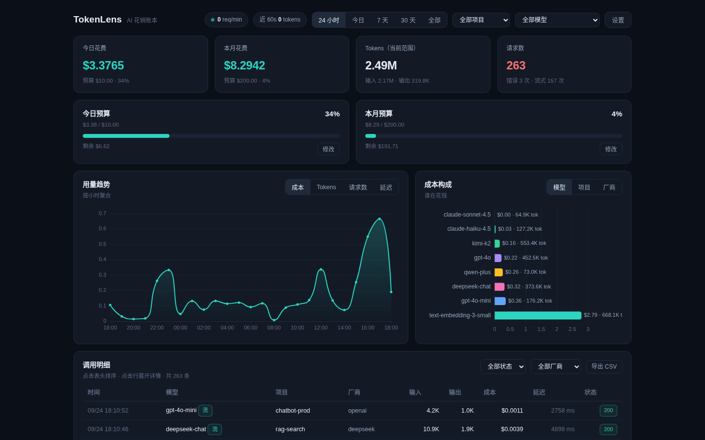
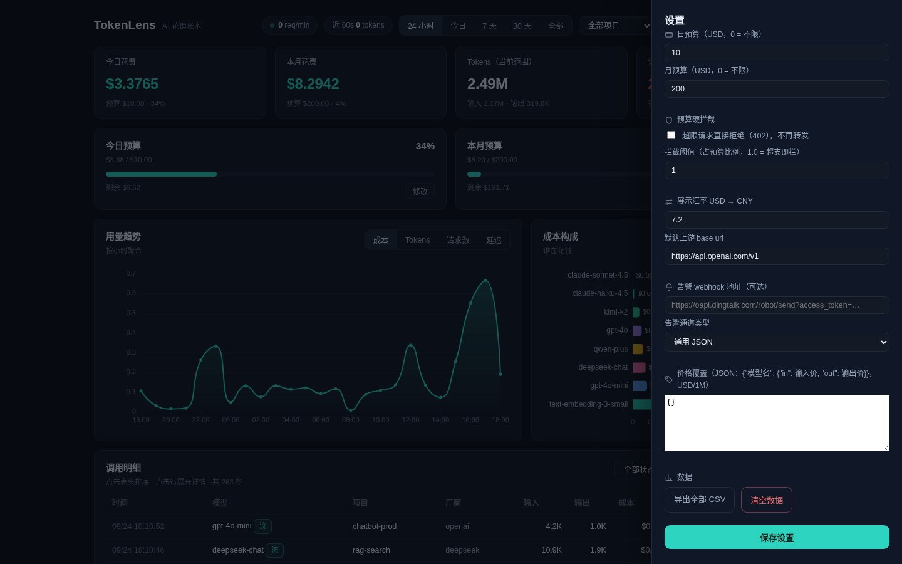
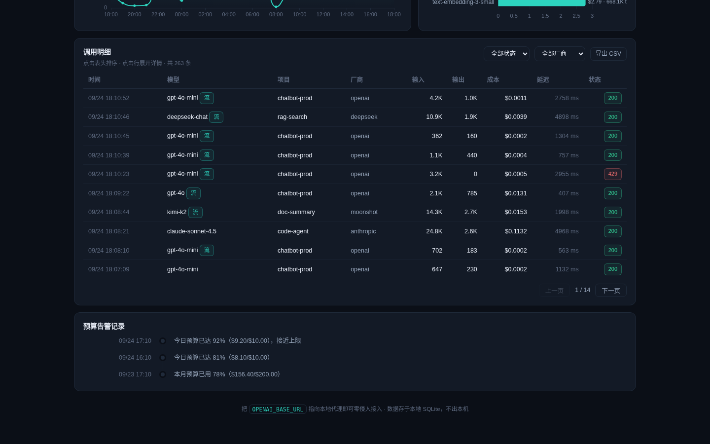
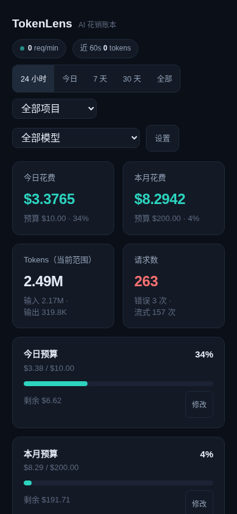
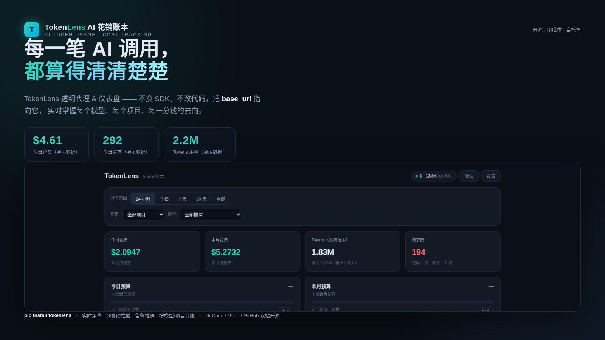
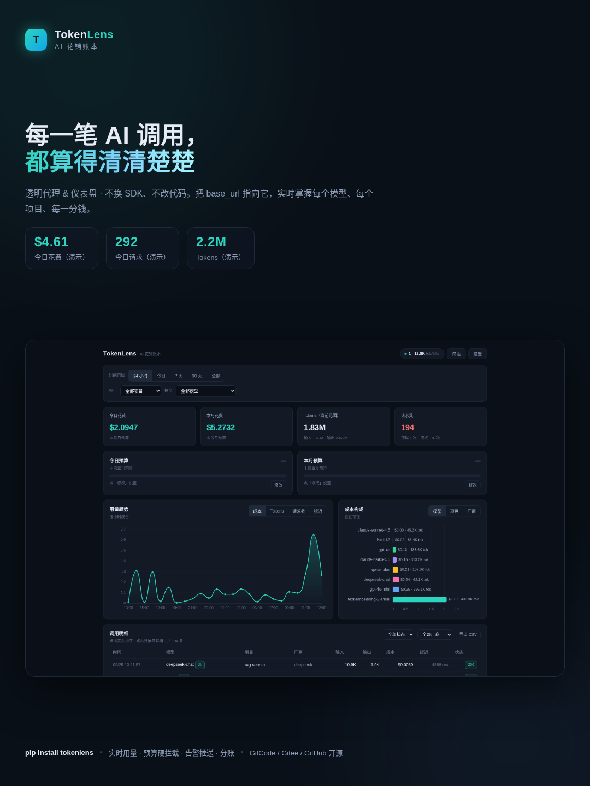
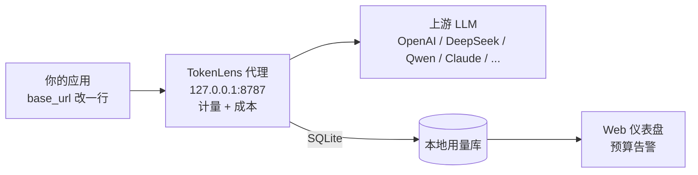

# TokenLens · AI Token 用量监控

**English**: [README.en.md](README.en.md) · 中文版

零侵入的本地透明代理：改一行 `base_url`，把每次 AI 调用的 token 数、成本、延迟记进本地 SQLite，配一个「花销账本」仪表盘和预算预警。数据不出本机，不用任何云服务。

## 快速开始

```bash
pip install .                # 装上 tokenlens 命令（或 pip install -r requirements.txt）
python -m tokenlens start    # 代理 + 仪表盘，默认 127.0.0.1:8787
```

然后把客户端的 base_url 指过来：

```bash
export OPENAI_BASE_URL=http://127.0.0.1:8787/v1
export OPENAI_API_KEY=sk-xxx    # key 原样透传上游，不落库
```

打开 **http://127.0.0.1:8787** 就是仪表盘。没有真实 Key 也能体验：
`python examples/mock_upstream.py` 起模拟上游，或 `python -m tokenlens seed-demo` 灌演示数据。

## 演示

30 秒真实操作演示（本地浏览器录制，含骨架屏加载、KPI 数字滚动、图表维度切换、明细展开、设置抽屉与告警时间轴）：

<video src="docs/media/tokenlens-promo.mp4" controls width="720" poster="docs/media/desktop.png"></video>

视频文件：`docs/media/tokenlens-promo.mp4`（22s，约 1.5MB）

桌面端完整仪表盘：



设置抽屉（日/月预算、硬拦截、汇率、Webhook、价格覆盖）：



预算告警时间轴：



移动端适配：



## 品牌视觉

品牌宣传视频（30 秒：品牌片头 → 真实操作演示 → 品牌片尾）：

<video src="docs/media/tokenlens-brand.mp4" controls width="720" poster="docs/media/brand-wide.png"></video>

品牌主视觉 · 横版（1600×900，官网 / 社媒头条 / 公众号头图）：



品牌主视觉 · 竖版（1080×1440，小红书 / 朋友圈 / 手机海报）：



## 它怎么工作



不改业务代码，不碰你的 API Key（Authorization 头原样转发），数据全部留在本机。

## 仪表盘（花销账本）

- **钱为主线**：今日 / 本月花费大数字 + 日 / 月预算进度条，超 80% 变琥珀、超支变红，预算直接在面板里改
- **用量趋势**：成本 / tokens / 请求数 / 延迟切换，按小时或天聚合
- **成本构成**：按模型 / 项目 / 厂商看谁在花钱
- **调用明细**：列头排序、状态 / 厂商筛选、分页、点行展开错误详情、导出 CSV
- **设置抽屉**：预算、汇率、告警 webhook、价格覆盖、清空数据一屏搞定
- 首次接入在页面顶部有引导横幅（一键复制 base_url）；**离线直接打开 `tokenlens/web/index.html` 也能看内嵌演示数据**

## 多厂商接入

同一端口按路径别名路由（别名在 `~/.tokenlens/config.json` 的 `upstreams` 配置，内置 openai / deepseek / moonshot / zhipu / dashscope / anthropic / siliconflow）：

```
http://127.0.0.1:8787/v1/chat/completions           → 默认上游
http://127.0.0.1:8787/v1/deepseek/chat/completions  → DeepSeek
http://127.0.0.1:8787/v1/dashscope/chat/completions → 通义千问（OpenAI 兼容）
http://127.0.0.1:8787/v1/anthropic/v1/messages      → Claude 原生 API
```

请求头 `X-TokenLens-Upstream: <url>` 临时指定上游，`X-TokenLens-Project: <name>` 打业务标签（按项目统计用）。

## 计量与成本

- **SSE 流式**：逐 chunk 透传同时解析 usage，自动注入 `stream_options.include_usage`，记录首字延迟（TTFT）
- **精确优先**：上游返回 usage 用精确值（含缓存命中、推理 token）；不回传时用 tiktoken，再退化为中英加权估算（明细里标 `估`）
- **成本计算**：价格表从 LiteLLM 同步（2000+ 模型，`scripts/sync_pricing.py` 可更新），豆包 / Kimi 等国内模型内置兜底；缓存命中按厂商折扣计（OpenAI 0.25 折）；未知模型计 0，不污染报表
- 改价：`python -m tokenlens pricing --set-model my-model 1.0 4.0`（USD / 1M tokens）

## 预算告警

```bash
python -m tokenlens budget --daily 20 --monthly 400
```

达阈值 80% 告警（日预算 1 小时内只报一次、月预算 24 小时内只报一次，避免刷屏）：仪表盘预算条变色、控制台输出、可选 webhook 推送（支持钉钉 / 企业微信 / 飞书 / 通用 JSON）。历史记录在仪表盘「预算告警记录」和 `python -m tokenlens alerts` 里都能查。

**预算硬拦截**（默认开启）：预算超限后新请求直接 402 拒绝、不再转发上游（响应 `X-TokenLens-Scope: daily|monthly`，明细标「拒」）；可在设置抽屉或 `config set enforce_budget false` 关闭，`enforce_budget_ratio` 可提前到 80% 就拦。

## CLI

```bash
python -m tokenlens start       [--port 8787] [--upstream URL] [--daily 20]
python -m tokenlens stats       [--range 7d] [--project X] [--model Y] [--json]
python -m tokenlens top         [--field model|project|provider|endpoint|day]
python -m tokenlens export      [--out usage.csv] [--range 30d]
python -m tokenlens pricing     [--model gpt-4o] [--set-model NAME IN OUT]
python -m tokenlens budget      [--daily 20] [--monthly 400]
python -m tokenlens alerts      [--limit 20]
python -m tokenlens seed-demo   [--n 600] [--days 7]
python -m tokenlens reset       # 清空数据
python -m tokenlens live        # 实时查看近 60 秒流量
python -m tokenlens config get KEY          # 查看单个配置项
python -m tokenlens config set KEY VALUE    # 修改配置项（自动按类型转换）
python -m tokenlens doctor      # 环境自检
```

## 配置（~/.tokenlens/config.json）

| 键 | 默认 | 说明 |
|---|---|---|
| `port` / `host` | 8787 / 127.0.0.1 | 监听地址 |
| `upstreams` | 内置 7 家 | 路径别名 → 上游 base url |
| `default_upstream` | OpenAI | 无别名时的转发目标 |
| `budget_daily` / `budget_monthly` | 10 / 200 | 预算（USD），0 = 不限 |
| `cached_discounts` | `{"openai": 0.25}` | 按厂商缓存命中折扣 |
| `pricing_overrides` | `{}` | 自定义价格 `{model:{in,out}}` USD/1M |
| `usd_cny_rate` | 7.2 | 仪表盘人民币换算 |
| `webhook_url` / `webhook_type` | 空 / generic | 告警推送地址与通道（dingtalk / wecom / feishu） |
| `inject_stream_usage` | true | 流式自动要求上游回传 usage |
| `dashboard_token` | 空 | 仪表盘访问令牌（留空不鉴权；配置后 API 需 `Authorization: Bearer <token>`） |
| `enforce_budget` | true | 预算硬拦截开关（超限请求 402 拒绝） |
| `enforce_budget_ratio` | 1.0 | 拦截阈值（占预算比例，0.8 = 用到 80% 就拦） |

环境变量速配：`TOKENLENS_PORT`、`TOKENLENS_UPSTREAM`、`TOKENLENS_DAILY_BUDGET`。

## 测试

```bash
python scripts/smoke_test.py   # 端到端冒烟（38 项：转发/流式/并发/预算/拦截/链路头/SDK/CLI）
python scripts/unit_test.py    # 单元测试（34 项：价格表/成本/store/拦截/鉴权/webhook）
```

## 目录结构

```
tokenlens/
├── tokenlens/                # 包
│   ├── proxy.py              # 透明代理（SSE 行缓冲解析 + 共享连接池）
│   ├── meter.py              # 计量核心 + 预算告警 + webhook 卡片
│   ├── tokenizer.py          # token 计数（usage > tiktoken > 启发式）
│   ├── pricing.py            # 价格表（LiteLLM 同步 + 内置兜底）与成本计算
│   ├── store.py              # SQLite 存储与聚合（读连接 + 独立写连接）
│   ├── api.py                # 仪表盘 REST API（统计 / 设置 / 导出 / 告警）
│   ├── server.py             # 服务组装（共享 httpx 连接池）
│   ├── sdk.py                # 装饰器 / monkeypatch 埋点
│   ├── demo.py               # 演示数据生成
│   ├── pricing_data.json     # LiteLLM 价格快照（sync_pricing.py 更新）
│   └── web/                  # 单文件仪表盘（离线可看演示）+ 自托管 ECharts
├── examples/mock_upstream.py # 模拟上游
├── scripts/smoke_test.py     # 端到端测试
├── scripts/unit_test.py      # 单元测试
└── scripts/sync_pricing.py   # 同步模型价格表
```

## 隐私与边界

- 只记录元数据（模型、token、成本、延迟、状态、字节量），不记录 prompt / 响应内容
- Authorization 头仅转发不落库，API Key 只存 SHA-256 前 12 位指纹
- 单机单进程 SQLite，适合个人与中小团队本地网关；跨机汇总可定期 `export` CSV

仓库地址：<https://gitcode.com/badhope/tokenlens>
