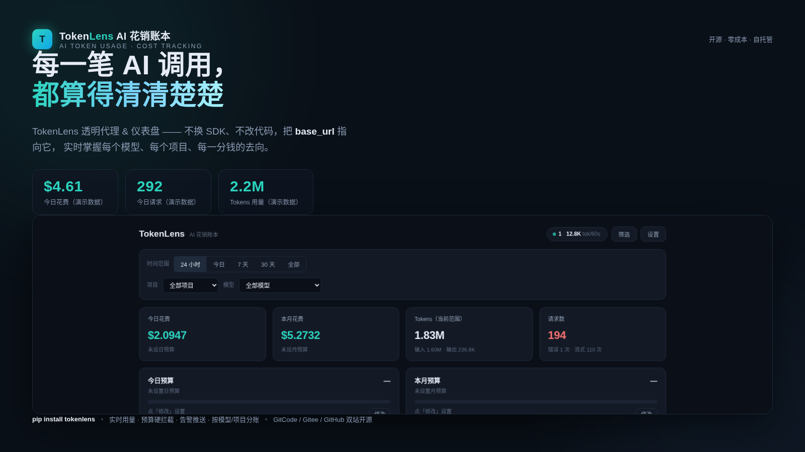
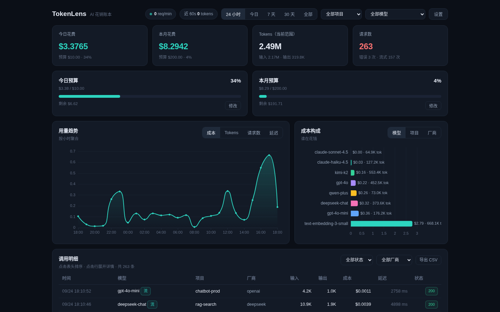
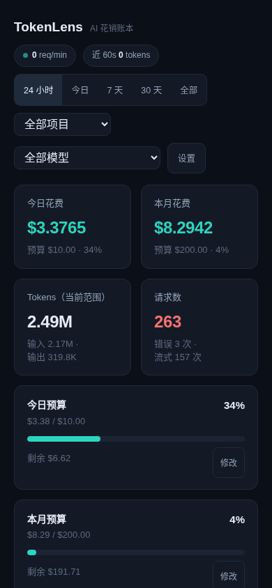
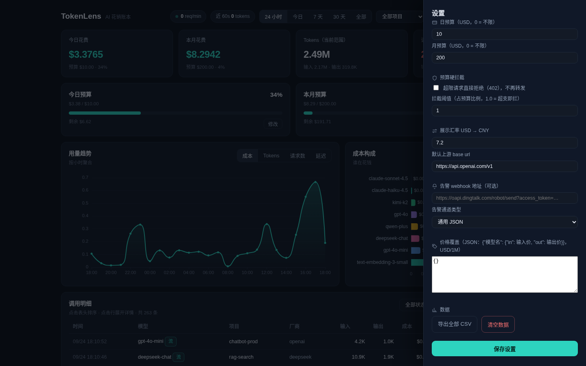
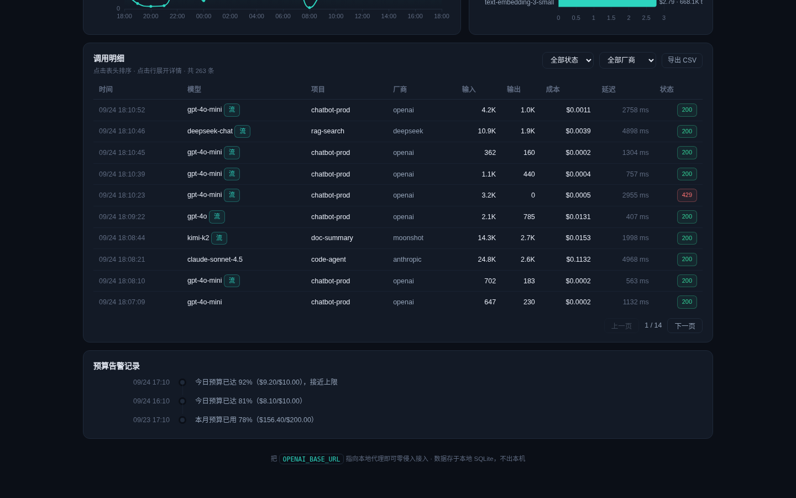
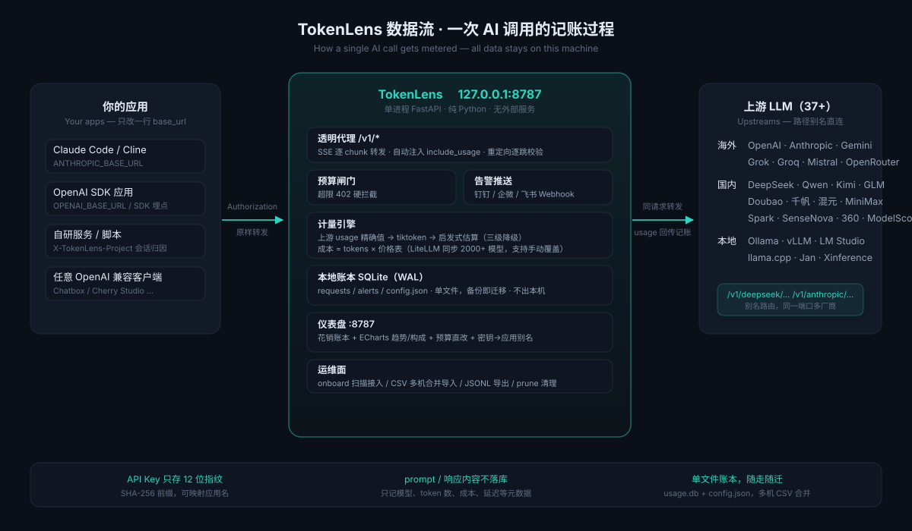

<div align="center">



# TokenLens

**把每次 AI 调用的 token 与花销，记成一本本地账本。**

零侵入透明代理 · 数据不出本机 · 37+ 上游 · 5 分钟接入

[](LICENSE)
[](pyproject.toml)
[](scripts/smoke_test.py)
[](CHANGELOG.md)

[官网（中文）](https://x33834.github.io/tokenlens/) ｜ [English](README.en.md) ｜ [更新日志](CHANGELOG.md)

</div>

---

<table>
<tr><td width="50%">

**你遇到的问题**

- 月底看账单才发现这个月烧了几百刀
- 多个项目 / 多个应用混在一起，说不清钱花在哪
- 想限制用量，只能靠手动盯着
- 用了云端监控，prompt 和密钥都要交给第三方

</td><td width="50%">

**TokenLens 的做法**

- 每一笔调用实时记账：token、成本、延迟、成功与否
- 按项目 / 应用 / 模型 / 厂商拆分，透视到「谁在花钱」
- 预算阈值告警，超限直接 402 拦截，不转发上游
- 全程本机：只记元数据，prompt / 响应不落库，密钥只存指纹

</td></tr>
</table>

## 60 秒上手

```bash
# 1. 安装并启动（默认端口 8787）
pip install . && python -m tokenlens start

# 2. 把客户端的 base_url 指过来（任何 OpenAI 兼容应用都行）
export OPENAI_BASE_URL=http://127.0.0.1:8787/v1

# 3. 打开花销账本
http://127.0.0.1:8787
```

到此结束。不需要改任何业务代码，不需要注册任何服务。没有真实 Key 也能体验：`python -m tokenlens seed-demo` 灌演示数据，或 `python examples/mock_upstream.py` 起模拟上游。

### 其他部署方式

| 方式 | 适合 | 命令 |
|---|---|---|
| pip / 源码 | 日常开发 | 上面的三行 |
| Docker | 服务器 / NAS 常驻 | `docker compose up -d`（[Dockerfile](Dockerfile)） |
| Windows 免安装 | 双击就用的桌面用户 | PyInstaller 单文件 `dist/TokenLens.exe`，双击即起（代理 + 仪表盘 :8788） |
| 多机合并 | 几台机器分开跑 | 各自导出 CSV → `tokenlens import-csv` 幂等合并 |

## 它长什么样

<video src="docs/media/tokenlens-promo.mp4" controls width="720" poster="docs/media/desktop.png"></video>

*22 秒真实操作：骨架屏 → KPI 数字滚动 → 图表维度切换 → 明细展开 → 设置抽屉 → 告警时间轴。另有 [9 秒快速版](docs/media/tokenlens-demo-live.webm)。*

| 桌面端 | 移动端 |
|---|---|
|  |  |

| 设置抽屉 | 告警时间轴 |
|---|---|
|  |  |

## 架构



几个关键设计：

- **计量三级降级**：优先用上游回传的 usage（最准），没有就 tiktoken 精确编码，再没有就启发式估算——离线、未知模型也能出数，账本永远有账可对
- **流式完整记账**：SSE 逐 chunk 解析，自动注入 `include_usage` 让上游回传真实用量，跨 chunk 切碎也不丢
- **预算硬拦截在转发之前**：超限请求直接 402，不浪费上游额度
- **密钥只存指纹**：SHA-256 前 12 位，可映射成应用名（显示「Claude Code」而不是一串哈希）

## 特性一览

| | 能做什么 |
|---|---|
| 代理 | OpenAI 兼容协议；SSE 流式；37+ 上游路径别名（`/v1/deepseek/…`）；重定向逐跳校验 |
| 计量 | tokens（含 cached / reasoning）、成本（LiteLLM 价格表 2000+ 模型 + 手动覆盖）、延迟 / TTFT / P95 |
| 归因 | 项目（请求头）· 会话（session）· 应用（密钥指纹别名）· 厂商 / 模型 / 端点 |
| 仪表盘 | 今日 / 本月花费、预算进度条、趋势图（成本 / tokens / 请求 / 延迟）、成本构成、可排序明细、离线演示数据 |
| 预算 | 日 / 月预算，80% 告警，超限 402；钉钉 / 企业微信 / 飞书 Webhook |
| 数据 | CSV 导出（防公式注入）/ JSONL 导出 / CSV 多机幂等导入；retention 自动清理 |
| 接入 | `tokenlens onboard` 扫描本机 AI 应用并自动改写（Claude Code，可还原）；SDK 埋点（装饰器 / openai 补丁） |
| 安全 | 本机优先；dashboard_token 鉴权；CSRF 防护；DNS rebinding 防护；请求体大小上限；完整分析见 [docs/ANALYSIS.md](docs/ANALYSIS.md) |

## 质量与测试

```
单元测试        59/59   （计量 / 存储 / 鉴权 / 价格 / SDK）
onboard 测试    26/26   （接入 / 还原 / 别名）
端到端冒烟      52/52   （真实进程：代理 → mock 上游 → 断言账本）
类型检查        mypy 0 error（CI 门禁）
攻击回归        31 项    （SSRF / 注入 / CSRF / 并发 / 计量精度）
```

## 已知边界（诚实声明）

- 预算硬拦截在极端并发下是尽力而为（先查后记的固有竞态），个人用量场景足够
- 价格表是快照（CI 每月自动同步 LiteLLM），厂商调价可能有滞后，可在设置里手动覆盖
- 多机 Postgres 后端在路线图中，当前只支持 SQLite

## 文档

[更新日志](CHANGELOG.md) · [架构与安全分析](docs/ANALYSIS.md) · [贡献指南](CONTRIBUTING.md) · [安全策略](SECURITY.md) · [中文官网](https://x33834.github.io/tokenlens/)

## 许可

[MIT](LICENSE) —— 随便用。如果回来提个 issue 说说你拿它干了什么，那就更好了。
